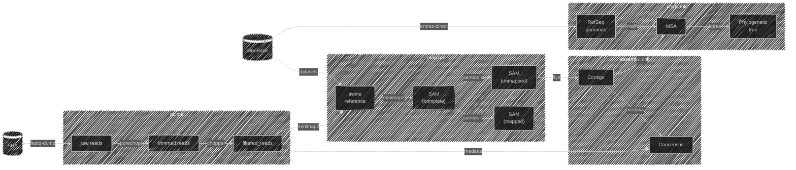
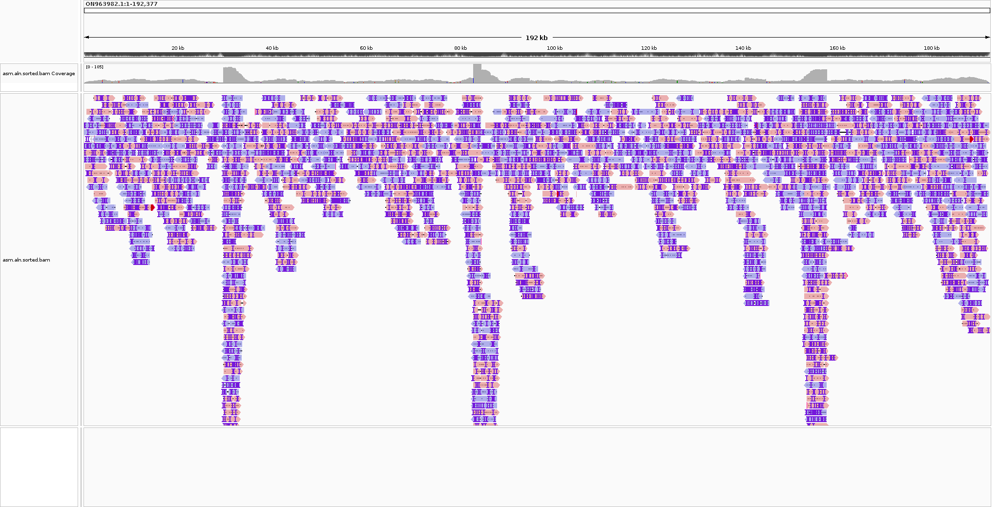

# Viral Genome Assembly from Long Reads

The aims of this repository is to reproduce the results generated by a study by [Montecillo et al.](https://journals.asm.org/doi/10.1128/mra.00719-22) on viral genome assembly using minION reads.

### Workflow

1. Retrieval of sequencing reads (PRJNA857442) and swine reference genome (GCF_000003025.6)
2. Quality control with `porechop` (v0.2.4)
3. Host read removal (decontamination) with `minimap2` (v2.17-r941)
4. _de novo_ assembly with Flye (v2.4.2)
5. Refinement of the draft assembly with `medaka` (v1.4.4)
6. Whole genome alignment with `mafft` (v7.490)
7. ML tree inference with `iqtree` (v2.2.0)



### Environment Setup

Create a yaml file containing a list of dependencies. Include the versions to ensure reproducibility.

```yaml
name: asfv-assembly
channels:
  - bioconda
  - conda-forge
dependencies:
  - flye
  - iqtree=2.2
  - mafft
  - medaka
  - minimap2=2.17
  - porechop=0.2.4
  - python=3.11
```

Create environment using `micromamba` and activate:
```bash
micromamba create -f env.yml
```

### Code Organization

The commands to carry out each step in the pipeline are organized as Makefiles within the `src` directory:

- `fetck.mk`: retrieve all read/sequence data associated with the study.
- `qc.mk`: perform adapter trimming and quality filtering on raw reads.
- `map.mk`: carry out host-read decontamination and convert unmapped reads into a FASTQ file.
- `assemble.mk`: generate draft assembly and call consensus sequence.
- `phylo.mk`: align draft assembly against all other RefSeq genomes and bootstrap a phylogenetic tree.

Invoke the `usage` command for list down all targets for a Makefile. Alternatively, run the Makefile without specifying a target:
```bash
# Equivalent to the command above.
make -f src/fetch.mk

# Print targets.
make -f src/fetch.mk usage
```

### Running the Pipeline

Clone the repository in your local environment and move into it:
```bash
git clone https://github.com/dagsdags212/asfv-long-read-assembly.git
cd asfv-long-read-assembly
```

Create conda environment from the `env.yml` file:
```bash
micromamba create -f env.yml
```

Activate conda environment:
```bash
micromamba activate asfv-assembly
```

Run `make` at the root directory to run the complete pipeline:
```bash
make
```

Or, run separate steps sequentially:
```bash
# Download reads from SRA and sequences from GenBank.
make -f src/fetch.mk run

# Trim and filter raw reads.
make -f src/qc.mk run

# Filter out host-read contaminants.
make -f src/map.mk run

# Assembly draft genome and polish.
make -f src/assemble.mk run

# Align draft assembly against RefSeq sequences and generate tree.
make -f src/phylo.mk run
```

## Results

### Raw Reads

|file                   |format|type|num_seqs|sum_len |min_len|avg_len|max_len|
|:----------------------|:-----|:---|:-------|:-------|:------|:------|:------|
|reads/SRR20073667.fastq|FASTQ |DNA |1422    |5785918 |94     |4068.9 |29964  |
|reads/SRR31340505.fastq|FASTQ |DNA |12000   |22587933|63     |1882.3 |17505  |
|reads/SRR31340506.fastq|FASTQ |DNA |12000   |60925466|764    |5077.1 |20708  |
|reads/SRR31340507.fastq|FASTQ |DNA |12000   |51040598|590    |4253.4 |90818  |
|reads/SRR31340508.fastq|FASTQ |DNA |12000   |58456021|644    |4871.3 |14897  |
|reads/SRR31340509.fastq|FASTQ |DNA |12000   |55698946|643    |4641.6 |15042  |
|reads/SRR31340510.fastq|FASTQ |DNA |12000   |50278720|689    |4189.9 |15730  |
|reads/SRR31340511.fastq|FASTQ |DNA |12000   |45989520|777    |3832.5 |14665  |
|reads/SRR31340512.fastq|FASTQ |DNA |12000   |60241250|675    |5020.1 |16649  |
|reads/SRR31340513.fastq|FASTQ |DNA |12000   |56711095|639    |4725.9 |16324  |

### Quality Control

|file                                      |format|type|num_seqs|sum_len  |min_len|avg_len|max_len|
|:-----------------------------------------|:-----|:---|:-------|:--------|:------|:------|:------|
|input/all_reads.fastq                     |FASTQ |DNA |109422  |467715467|63     |4274.4 |90818  |
|output/01_all_reads.trimmed.fastq         |FASTQ |DNA |108815  |461626859|7      |4242.3 |90818  |
|output/02_all_reads.trimmed.filtered.fastq|FASTQ |DNA |101524  |459347886|501    |4524.5 |90818  |

### Filtering

Results of running `samtools flagstat`:
```
101524 + 0 in total (QC-passed reads + QC-failed reads)
101524 + 0 primary
0 + 0 secondary
0 + 0 supplementary
0 + 0 duplicates
0 + 0 primary duplicates
0 + 0 mapped (0.00% : N/A)
0 + 0 primary mapped (0.00% : N/A)
0 + 0 paired in sequencing
0 + 0 read1
0 + 0 read2
0 + 0 properly paired (N/A : N/A)
0 + 0 with itself and mate mapped
0 + 0 singletons (N/A : N/A)
0 + 0 with mate mapped to a different chr
0 + 0 with mate mapped to a different chr (mapQ>=5)
```

Post-processed reads mapped back to the published assembly (ON963982.1):


### Assembly

|file                         |format|type|num_seqs|sum_len|min_len|avg_len|max_len|
|:----------------------------|:-----|:---|:-------|:------|:------|:------|:------|
|output/flye/assembly.fasta   |FASTA |DNA |104     |490089 |1760   |4712.4 |189394 |
|output/medaka/consensus.fasta|FASTA |DNA |91      |455711 |1769   |5007.8 |189419 |

### Tree Inference


